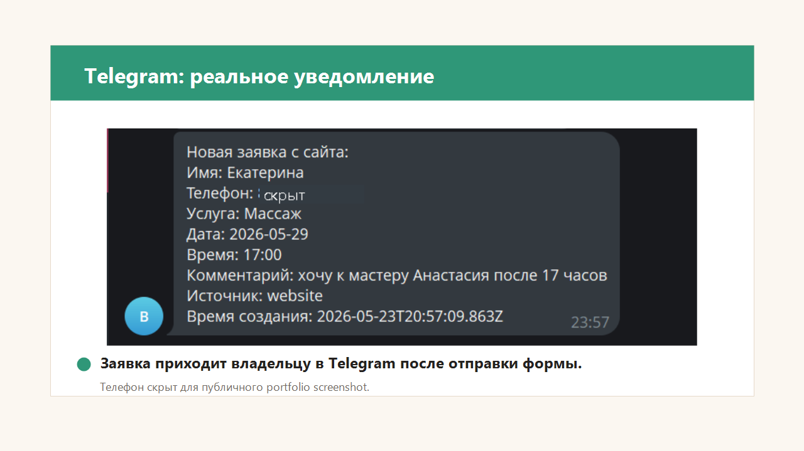
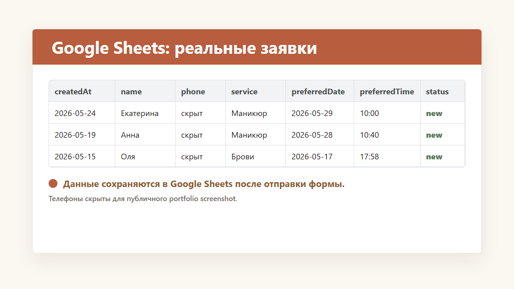

# Beauty Lead System

**Beauty Lead System** — портфолио-пример системы заявок для beauty-бизнеса: лендинг, форма заявки, Telegram-уведомления и сохранение обращений в Google Sheets.

Это не “готовый продукт, который продаётся именно в таком виде”, а демонстрация формата услуги:

> Я могу сделать похожую систему под ваш бизнес: с вашим дизайном, услугами, текстами, формой, уведомлениями и таблицей/CRM.

## Live demo

- Сайт: https://beauty-lead-system.vercel.app
- GitHub: https://github.com/marina-zhuk/beauty-lead-system

## Как работает система

```text
Лендинг -> форма заявки -> /api/lead -> Telegram владельцу -> Google Apps Script -> Google Sheets
```

1. Клиент открывает лендинг.
2. Выбирает услугу и оставляет контактные данные.
3. Заявка проходит валидацию на backend.
4. Владелец получает уведомление в Telegram.
5. Данные сохраняются в Google Sheets для дальнейшей обработки.

## Что показывает этот проект

- Умение собрать landing page под конкретную нишу.
- Рабочий lead form с валидацией.
- Интеграцию с Telegram Bot API.
- Интеграцию с Google Sheets через Google Apps Script.
- Понятный MVP-flow: заявка не теряется, владелец быстро видит обращение.
- Возможность быстро адаптировать такую систему под другой бизнес.

## Для кого можно адаптировать

- салоны красоты;
- частные beauty-мастера;
- студии маникюра / бровей / lash-услуг;
- косметологи и массажисты;
- фитнес-студии;
- репетиторы и эксперты;
- локальные сервисные бизнесы.

## Бизнес-проблема

У малого бизнеса заявки часто приходят из разных каналов: сайт, реклама, Direct, Telegram, WhatsApp, личные сообщения. Из-за этого владелец может поздно увидеть обращение, потерять контакт или забыть вернуться к клиенту.

## Решение

Один простой поток обработки заявок:

- клиент оставляет заявку на сайте;
- владелец сразу получает сообщение в Telegram;
- контакт сохраняется в таблице;
- администратор или владелец может вернуться к клиенту и довести заявку до записи.

## Что входит в MVP

- адаптивный landing page;
- форма заявки;
- API endpoint `POST /api/lead`;
- валидация данных через Zod;
- Telegram notification;
- Google Sheets integration через Google Apps Script;
- success/error состояния формы;
- environment-based configuration;
- rate limit для защиты от частого спама;
- документация по setup, API, интеграциям и тестированию.

## Скриншоты работы

### Telegram-уведомление



### Заявка в Google Sheets



Дополнительный чеклист скриншотов: [docs/screenshots/README.md](docs/screenshots/README.md)

## Портфолио-кейс

- Полное описание кейса: [docs/portfolio-case.md](docs/portfolio-case.md)
- Чеклист demo-flow: [docs/demo-flow.md](docs/demo-flow.md)

Короткое позиционирование:

```text
Система заявок для малого бизнеса:
лендинг -> форма -> Telegram-уведомление -> Google Sheets / CRM.
```

## Примеры коммерческих пакетов

- **Start — от 7 000 ₽**: форма заявки и Telegram-уведомление.
- **Standard — от 15 000 ₽**: лендинг, форма, Telegram, Google Sheets.
- **Pro — от 30 000 ₽**: расширенная форма, статусы заявок, дополнительные сценарии автоматизации.

## Что можно изменить под клиента

- нишу и визуальный стиль;
- тексты лендинга;
- услуги и поля формы;
- Telegram-сообщение;
- структуру Google Sheets;
- статусы обработки заявок;
- подключение CRM или других API;
- домен и production deployment.

## Tech stack

- Next.js
- React
- TypeScript
- Tailwind CSS
- Zod
- ESLint
- Telegram Bot API
- Google Apps Script
- Google Sheets
- Vercel

## Environment variables

Проект использует переменные окружения для интеграций. Реальные токены, chat ID и webhook URL нельзя коммитить в репозиторий.

Используйте `.env.example` как шаблон и создайте `.env.local` для локального запуска.

- `TELEGRAM_BOT_TOKEN` — Telegram bot token для отправки уведомлений.
- `TELEGRAM_CHAT_ID` — chat ID, куда приходят заявки.
- `GOOGLE_APPS_SCRIPT_WEBHOOK_URL` — URL Google Apps Script Web App для записи заявок в Google Sheets.

## Локальный запуск

```bash
npm install
cp .env.example .env.local
npm run dev
```

Открыть:

```text
http://localhost:3000
```

На Windows PowerShell в этом workspace:

```bash
npm.cmd run dev
```

## Deployment

Проект готов к деплою на Vercel.

Базовый порядок:

1. Push в GitHub.
2. Import project в Vercel.
3. Добавить environment variables в Vercel Project Settings.
4. Deploy.
5. Отправить тестовую заявку.
6. Проверить Telegram-уведомление.
7. Проверить новую строку в Google Sheets.

## Demo limitations

Это portfolio MVP / demo, а не полноценная CRM.

В текущей версии нет:

- авторизации для администратора;
- полноценной CRM-панели;
- онлайн-оплаты;
- календаря записей;
- production captcha;
- личного кабинета клиента.

Эти функции можно добавить отдельно, если они нужны конкретному бизнесу.

## Validation checklist

- `npm run lint`
- `npm run build`
- live demo opens correctly
- test lead reaches Telegram
- test lead appears in Google Sheets
